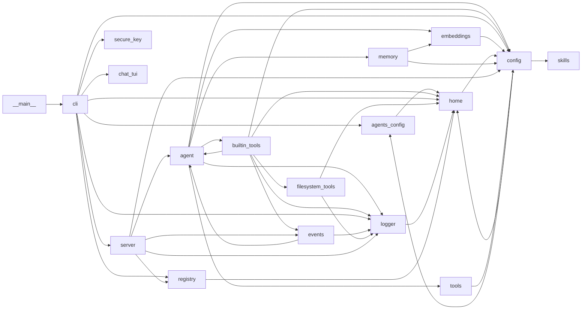

# Developer Guide

This document is a high-level map of the agenthost codebase, its runtime data directory, and how the source files relate to each other.

## Project Root Python File

The project's entry point is **`src/agenthost/__main__.py`**. Running `python -m agenthost` loads `agenthost.cli:main()` from `src/agenthost/cli.py`.

`pyproject.toml` declares the same entry point as a console script:

```toml
[project.scripts]
agenthost = "agenthost.cli:main"
```

So `agenthost serve ...` and `python -m agenthost ...` both end up in `cli.py`.

## What Each File in `src/agenthost` Does

| File | Purpose |
|------|---------|
| `__main__.py` | Module execution entry point (`python -m agenthost`). Delegates to `cli.main()`. |
| `__init__.py` | Package metadata (currently only `__version__`). |
| `cli.py` | Console command dispatcher: `serve`, `chat`, `list`, `key`, `agent`. Parses arguments, loads secrets, and dispatches to the server, chat client, or registry. |
| `server.py` | FastAPI + uvicorn server. Builds the HTTP/SSE app, wires the scheduler, loads events, registers the running agent, and streams chat responses. |
| `agent.py` | Core `Agent` class. Loads config, memory, tools, and skills; builds the LLM message payload; runs the chat/tool loop; handles reasoning and output sanitization. |
| `config.py` | `AgentConfig` dataclass and loader. Reads `agent.yaml`, `.agenthost/default_agent.yaml`, `WHOAMI.md`, `CRITICAL.md`, and builds the system prompt (including skill descriptions and orchestrator roster). |
| `agents_config.py` | Manages `agents.yaml` — the global alias → agent-folder mapping used by `agenthost serve <alias>` and `agenthost agent`. |
| `tools.py` | Tool discovery from `tools/*.py` and the built-in tool registry. Builds OpenAI-style tool schemas, coerces arguments, and runs tools in-process. |
| `builtin_tools.py` | Built-in tools available to every agent: `get_current_datetime`, `get_skill`, `skill_crud`, `event_tool`, `send_discord`, `get_current_thread_id`, `read_file`, `list_uploads`. |
| `events.py` | Scheduled-event models (`EventSchedule`, `ScheduledEvent`, `EventsConfig`) and APScheduler trigger generation. Reads `events.yaml` and runs scheduled prompts through the agent. |
| `skills.py` | Loads `.md` skill files from an agent's `skills/` folder. |
| `memory.py` | SQLite-backed conversation memory with RAG retrieval: stores messages, embeds chunks, and retrieves relevant older context for the prompt. |
| `embeddings.py` | Async OpenAI-compatible embedding client used by memory and tools. |
| `filesystem_tools.py` | Read-only filesystem tools (`read_file`, `list_uploads`) and upload text extraction (docx/pdf/xlsx/csv/txt/md). |
| `registry.py` | JSON file-backed registry of currently running agents, filtering out stale PIDs. |
| `home.py` | Home-directory helpers: locates `~/.agenthost` (or `AGENTHOST_HOME`), provides paths to `agents.yaml`, registry, keys, log, and migrates legacy project-root state. |
| `logger.py` | Centralized logging setup. Writes to `~/.agenthost/agenthost.log` and mirrors to stderr. |
| `secure_key.py` | Python-native KeePass `.kdbx` management (`pykeepass`) and helpers to load secrets into environment variables. |
| `chat_tui.py` | Textual-based interactive chat client with streaming, tool call/result cards, thread picker, `@path` context attachment, and chatless monitor mode. |

## What Lives in `~/.agenthost`

`~/.agenthost` is the runtime data directory. Its location can be overridden with the `AGENTHOST_HOME` environment variable.

On first run, `home.py` migrates legacy state from the project root (if it exists) into `~/.agenthost` and seeds a `default_agent.yaml`.

Typical contents:

| Path | Description |
|------|-------------|
| `~/.agenthost/agents.yaml` | Alias → agent folder mapping managed by `agenthost agent` and `AgentsConfig`. |
| `~/.agenthost/.agenthost-registry.json` | Running-agent registry (PID, name, host, port, start time). Used by `agenthost list`. |
| `~/.agenthost/keys.kdbx` | KeePass database of API keys and secrets, loaded by `agenthost key` and `cli.py` on serve. |
| `~/.agenthost/agenthost.log` | Persistent log file written by `logger.py`. |
| `~/.agenthost/default_agent.yaml` | Global default agent config (model, temperature, memory, etc.). |
| `~/.agenthost/uploads/` | Files uploaded by users (e.g. via Discord). `read_file` extracts text from office documents on demand. |
| `~/.agenthost/output/` | Agent-generated output such as documents or reports. |
| `~/.agenthost/memory/<agent>/` | Per-agent SQLite database (`memory.db`) storing conversation history and RAG embeddings. |
| `~/.agenthost/entries/` | Legacy/global data directory migrated from the project root. |

## Import Graph

This directed graph shows which `src/agenthost` files import which other `src/agenthost` files. Arrows point from the importer to the importee.



**Notes on the graph:**

- `__main__.py` is the root execution file; it immediately delegates to `cli.py`.
- `home.py` and `config.py` have a circular import at the AST level; `home.py` only imports `config.py` inside `_seed_default_agent_config()` to break the cycle at runtime.
- `builtin_tools.py` imports `agent.py` only under `if False:` for type hints, and `events.py` imports `agent.py` only under `TYPE_CHECKING`. These are runtime-safe.
